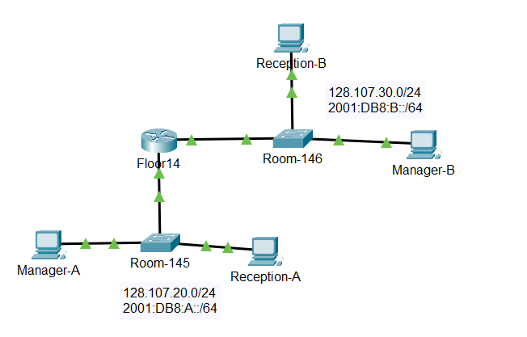

# Konfigurasi 

## Topologi

Terdiri dari:
- 1 Router (Floor14)
- 2 Switch (Room-145 dan Room-146)
- 4 PC (Manager dan Reception A dan B)

## Tabel Addressing
| Device     | Interface    | IPv4 Address     |  IPv6 Address     | Default Gateaway IPv4 | Default Gateaway IPv6 |
|------------|--------------|------------------|-------------------|-----------------------|-----------------------|
| Floor14    | G0/0         | 128.107.20.1/24  | 2001:DB8:A::1/64  | N/A                   | N/A                   |      
| Floor14    | G0/1         | 128.107.30.1/24  | 2001:DB8:B::1/64  | N/A                   | N/A                   |   
| Room-145   | VLAN 1       | 128.107.20.10/24 | -                 | 128.107.20.1          | -                     |
| Room-146   | VLAN 1       | 128.107.30.15/24 | -                 | 128.107.30.1          | -                     |
| Manager-A  | NIC          | 128.107.20.25/24 | 2001:DB8:A::25/64 | 128.107.20.1          | FE80::3               |
| Reception-A| NIC          | 128.107.20.30/24 | 2001:DB8:A::30/64 | 128.107.20.1          | FE80::3               |
| Manager-B  | NIC          | 128.107.30.25/24 | 2001:DB8:B::25/64 | 128.107.30.1          | FE80::1               |
| Reception B| NIC          | 128.107.30.30/24 | 2001:DB8:B::30/64 | 128.107.30.1          | FE80::1               |

